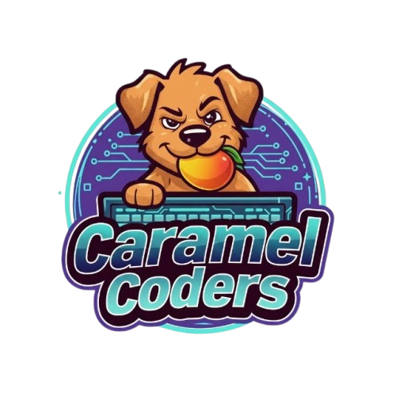

<p align="center">
  
</p>

# Caramel Coders BOCA


Ambiente BOCA customizado para competicoes da Caramel Coders. Inclui BOCA Web, Postgres, BOCA Jail com autojudge, Grafana e um Builder administrativo para gerar pacotes de problemas no padrao BOCA.

## Requisitos

- Docker Desktop em execucao.
- PowerShell no Windows.
- Bash, Docker Compose e `curl` no Linux ou macOS.

## Inicio rapido

Windows:

```powershell
.\boca_deploy.ps1 install
```

Linux ou macOS:

```bash
chmod +x ./boca_deploy.sh
./boca_deploy.sh install
```

O comando `install` constroi as imagens, sobe os containers, aguarda o BOCA responder e aplica os perfis padrao.

## Acessos

| Servico | URL |
| --- | --- |
| BOCA | http://localhost:8000/boca |
| Grafana | http://localhost:3001 |

Em rede local, Radmin ou Hamachi, troque `localhost` pelo IP da maquina que esta rodando o Docker:

```text
http://IP_DA_MAQUINA:8000/boca
```

## Credenciais

| Uso | Usuario | Senha |
| --- | --- | --- |
| Contest BOCA | `CCASuperControlContest` | `Ur#t4i@CCAIFG0!2026xZq` |
| Admin BOCA | `CCASuperControlRuntime` | `Ur#t4i@CCAIFG0!2026xZq2` |
| Grafana | `CCASuperOverview` | `Ur#t4i@CCAIFG0!2026xZq3` |

## Comandos

Windows:

```powershell
.\boca_deploy.ps1 install
.\boca_deploy.ps1 start
.\boca_deploy.ps1 stop
.\boca_deploy.ps1 status
.\boca_deploy.ps1 logs
.\boca_deploy.ps1 restart
.\boca_deploy.ps1 profiles
.\boca_deploy.ps1 open
.\boca_deploy.ps1 reset
```

Linux ou macOS:

```bash
./boca_deploy.sh install
./boca_deploy.sh start
./boca_deploy.sh stop
./boca_deploy.sh status
./boca_deploy.sh logs
./boca_deploy.sh restart
./boca_deploy.sh profiles
./boca_deploy.sh open
./boca_deploy.sh reset
```

O comando `reset` executa `docker compose down -v` e remove os volumes da stack. Use apenas quando quiser limpar banco, Grafana e dados atuais.

## Fluxo recomendado

1. Execute `install`.
2. Entre no BOCA com a conta de contest.
3. Crie ou ative o contest.
4. Entre com a conta admin.
5. Cadastre times, linguagens e problemas.
6. Use o menu `Builder` para criar pacotes de problemas quando quiser evitar montar ZIP BOCA manualmente.
7. Acompanhe as metricas pelo Grafana.

## Builder de problemas

O Builder fica no painel administrativo do BOCA. Ele gera um ZIP importavel como problema real do BOCA.

O que o Builder resolve:

- Cria a estrutura `description`, `input`, `output`, `limits`, `compile`, `run`, `compare` e `tests`.
- Gera PDF padronizado com o titulo `Problemas Caramel Coder's`.
- Usa a imagem `src/images/caramel-coders.png` no PDF.
- Permite casos publicos, que aparecem no PDF.
- Permite casos opacos, que entram no autojudge mas nao aparecem no PDF.
- Mantem o basename do problema, como `A`, `B` ou `C`, para submissao no formato esperado, como `A.java`.
- Evita caminhos quebrados como `../../compile` e `../../run`.

Para usar:

1. Acesse `Admin > Builder`.
2. Preencha nome, letra, limite, linguagens e enunciado.
3. Adicione os casos de teste.
4. Marque quais exemplos devem aparecer no PDF.
5. Gere o ZIP.
6. Importe o ZIP em `Admin > Problems`.

## Autojudge

O autojudge fica habilitado por padrao nos sites criados. O container `boca-jail` precisa estar rodando para julgar as submissoes.

Se uma run falhar, a tela administrativa mostra o estado do autojudge e, quando aplicavel, o input que falhou, por exemplo:

```text
(Wrong answer input A_11) Differences found
(WHILE RUNNING input E_35) Time limit exceeded
```

## Grafana

O Grafana fica em `localhost:3001` e usa o banco atual do BOCA. Ele mostra metricas dos contests existentes e historicos.

Se aparecer `No data`, confira:

- O datasource Postgres no Grafana.
- O filtro de contest no dashboard.
- O intervalo de tempo selecionado.
- Se existem runs julgadas no contest.

## Observacoes operacionais

- O Grafana esta exposto apenas em `localhost:3001`.
- O BOCA esta exposto na porta `8000`.
- O comando `profiles` reaplica usuarios padrao e ativa `siteautojudge`.
- Ao reutilizar o mesmo contest, o BOCA pode manter historico de submissao duplicada em `src/private/runslog`.
- Para uma competicao totalmente limpa, use `reset` e depois `install`.
